```mermaid
flowchart TB
    %% ─────────────────────────────────────────────
    %%  USERS
    %% ─────────────────────────────────────────────
    subgraph USERS["👤  End Users"]
        U_MOB["Mobile User\n(Android / iOS)"]
        U_WEB["Web User\n(Browser)"]
        U_EXT["Extension User\n(Chrome)"]
    end

    %% ─────────────────────────────────────────────
    %%  FRONTEND LAYER
    %% ─────────────────────────────────────────────
    subgraph FRONTEND["🖥️  Frontend Layer"]
        direction TB

        subgraph MOB["NexoraAI_Frontend — React Native + Expo"]
            MOB_SCAN["Scanner Screen\n(URL / SMS / Text)"]
            MOB_EDU["Edu Screen\n(Lessons · Quiz · Leaderboard)"]
            MOB_DASH["Dashboard\n(Scan History · Stats)"]
            MOB_SMS["useSmsScanner Hook\n(Native Android BroadcastReceiver)"]
            MOB_MODAL["AnalysisModal\n(Threat Result Display)"]
            MOB_API["api.js\n(Axios + Supabase JWT)"]
        end

        subgraph WEB["NexoraAI_Web — React 19 + Vite  ▶  Vercel"]
            WEB_DASH["Dashboard Page"]
            WEB_QUIZ["Daily Quiz Page"]
            WEB_LESSON["Lesson View Page"]
            WEB_SCAN["Scan History Page"]
            WEB_AUTH["Auth (Supabase SDK)"]
        end

        subgraph EXT["nexora-extension — Chrome MV3"]
            EXT_POPUP["popup.js / popup.css\n(Right-click scan UI)"]
            EXT_BG["background.js\n(Service Worker)"]
            EXT_CS["content.js\n(Page Injection)"]
        end
    end

    %% ─────────────────────────────────────────────
    %%  BACKEND LAYER
    %% ─────────────────────────────────────────────
    subgraph BACKEND["⚙️  Backend Layer — FastAPI Monolith  ▶  Render (Docker)"]
        direction TB

        subgraph ROUTES["API Routes  (NexoraAI/scanner/)"]
            R_SCAN["POST /scan\n(Single URL)"]
            R_TEXT["POST /scan/text\n(Free-text phishing check)"]
            R_BATCH["POST /scan/scan-batch\n(Bulk URL scan)"]
            R_HIST["GET  /scan/history\n(User scan history)"]
            R_SCEN["POST /generate-scenarios\n(AI scenario gen)"]
            R_EDU["GET/POST /edu/*\n(Lessons · Quiz · Progress · Leaderboard)"]
        end

        subgraph PIPELINE["3-Stage Detection Pipeline"]
            P1["Stage 1 — Heuristics Engine\n(577-line rule set · Safe-tx whitelist)"]
            P2["Stage 2 — ML Models\n(Scikit-learn phish_pipeline.joblib\n+ XGBoost phish_url_model.joblib)"]
            P3["Stage 3 — Gemini AI Fallback\n(gemini-2.0-flash)"]
            P_RESULT["Aggregated Verdict\n(risk_score · confidence · explanation)"]
        end

        CACHE_CHK{"Upstash Redis\nCache Hit?"}
    end

    %% ─────────────────────────────────────────────
    %%  AI / ML LAYER
    %% ─────────────────────────────────────────────
    subgraph AI["🤖  AI / ML Layer"]
        AI_HEURISTIC["Custom Heuristics Engine\n• 577 lines of rule logic\n• Safe-transaction whitelist\n• Domain entropy, typosquatting, etc."]
        AI_SKL["Scikit-learn Pipeline\nphish_pipeline.joblib\n(TF-IDF + Logistic Regression)"]
        AI_XGB["XGBoost URL Model\nphish_url_model.joblib\n(Gradient Boosted Trees)"]
        AI_GEMINI["Google Gemini 2.0 Flash\n(Stage-3 deep analysis & explanation)"]
        AI_GROQ["Groq — llama-3.3-70b\n(Scenario generation for Edu module)"]
        AI_ELEVEN["ElevenLabs\n(AI Voice Tutor — text-to-speech)"]
    end

    %% ─────────────────────────────────────────────
    %%  THREAT INTELLIGENCE
    %% ─────────────────────────────────────────────
    subgraph THREAT["🛡️  Threat Intelligence APIs"]
        TI_GSB["Google Safe Browsing API"]
        TI_VT["VirusTotal API"]
        TI_HIBP["Have I Been Pwned API"]
    end

    %% ─────────────────────────────────────────────
    %%  DATA LAYER
    %% ─────────────────────────────────────────────
    subgraph DATA["🗄️  Data Layer"]
        subgraph SUPA["Supabase (PostgreSQL + Auth)"]
            DB_PROF["profiles"]
            DB_HIST["scan_history"]
            DB_LESS["lessons"]
            DB_QUIZ["quiz_results"]
            DB_PROG["user_progress"]
            DB_LEAD["leaderboard"]
            DB_SET["user_settings"]
            SUPA_AUTH["Supabase Auth\n(JWT · RLS Policies)"]
        end
        REDIS["Upstash Redis\n(Scan result cache · TTL-based)"]
    end

    %% ─────────────────────────────────────────────
    %%  INFRASTRUCTURE
    %% ─────────────────────────────────────────────
    subgraph INFRA["☁️  Infrastructure"]
        RENDER["Render\n(Docker container · FastAPI)"]
        VERCEL["Vercel\n(React 19 + Vite · CDN)"]
        EAS["EAS — Expo Application Services\n(Android APK · iOS IPA builds)"]
        GITHUB["GitHub\nShaikhtouheed5/nexora-ai\n(main branch · CI/CD)"]
    end

    %% ═════════════════════════════════════════════
    %%  DATA-FLOW CONNECTIONS
    %% ═════════════════════════════════════════════

    %% Users → Frontend
    U_MOB -->|"uses"| MOB
    U_WEB -->|"uses"| WEB
    U_EXT -->|"uses"| EXT

    %% Mobile internals
    MOB_SMS --> MOB_SCAN
    MOB_SCAN --> MOB_MODAL
    MOB_SCAN --> MOB_API
    MOB_DASH --> MOB_API
    MOB_EDU  --> MOB_API

    %% Web internals
    WEB_AUTH --> WEB_DASH
    WEB_AUTH --> WEB_QUIZ
    WEB_AUTH --> WEB_LESSON
    WEB_AUTH --> WEB_SCAN

    %% Extension internals
    EXT_CS --> EXT_BG
    EXT_BG --> EXT_POPUP

    %% Frontend → Backend (HTTPS REST)
    MOB_API  -->|"HTTPS REST\n(Bearer JWT)"| ROUTES
    WEB_DASH -->|"HTTPS REST"| ROUTES
    WEB_SCAN -->|"HTTPS REST"| ROUTES
    EXT_POPUP -->|"HTTPS REST"| ROUTES
    EXT_BG -->|"HTTPS REST"| ROUTES

    %% Backend Cache Check
    R_SCAN  --> CACHE_CHK
    R_TEXT  --> CACHE_CHK
    R_BATCH --> CACHE_CHK
    CACHE_CHK -->|"Miss — run pipeline"| PIPELINE
    CACHE_CHK -->|"Hit — return cached"| P_RESULT

    %% Pipeline stages
    PIPELINE --> P1
    P1 -->|"Uncertain"| P2
    P2 -->|"Uncertain"| P3
    P1 -->|"Confident"| P_RESULT
    P2 -->|"Confident"| P_RESULT
    P3 --> P_RESULT

    %% Pipeline ↔ AI Layer
    P1 <-->|"rule evaluation"| AI_HEURISTIC
    P2 <-->|"inference"| AI_SKL
    P2 <-->|"inference"| AI_XGB
    P3 <-->|"LLM call"| AI_GEMINI

    %% Edu routes ↔ AI
    R_SCEN <-->|"prompt / response"| AI_GROQ
    R_EDU  <-->|"TTS request"| AI_ELEVEN

    %% Backend ↔ Threat Intelligence
    ROUTES <-->|"URL reputation"| TI_GSB
    ROUTES <-->|"multi-engine scan"| TI_VT
    ROUTES <-->|"breach lookup"| TI_HIBP

    %% Backend ↔ Data Layer
    ROUTES  <-->|"read / write"| SUPA
    P_RESULT -->|"persist result"| DB_HIST
    R_EDU   <-->|"lessons / quiz / progress"| DB_LESS
    R_EDU   <-->|"quiz results"| DB_QUIZ
    R_EDU   <-->|"user progress"| DB_PROG
    R_EDU   <-->|"leaderboard"| DB_LEAD
    ROUTES  <-->|"cache hit/miss"| REDIS
    SUPA_AUTH ---|"RLS on all tables"| DB_PROF

    %% Frontend ↔ Supabase Auth (direct SDK)
    MOB_API  <-->|"Supabase JS SDK"| SUPA_AUTH
    WEB_AUTH <-->|"Supabase JS SDK"| SUPA_AUTH

    %% Infrastructure hosting
    BACKEND -.->|"hosted on"| RENDER
    WEB     -.->|"deployed via"| VERCEL
    MOB     -.->|"built via"| EAS
    GITHUB  -.->|"source & CI/CD"| RENDER
    GITHUB  -.->|"source & CI/CD"| VERCEL
    GITHUB  -.->|"triggers build"| EAS

    %% ─────────────────────────────────────────────
    %%  STYLING
    %% ─────────────────────────────────────────────
    classDef frontend  fill:#1e3a5f,stroke:#4da6ff,color:#e0f0ff
    classDef backend   fill:#1a3a1a,stroke:#4caf50,color:#e0ffe0
    classDef ai        fill:#3a1a3a,stroke:#bb86fc,color:#f3e0ff
    classDef data      fill:#3a2a10,stroke:#ffb74d,color:#fff3e0
    classDef threat    fill:#3a1a1a,stroke:#ef5350,color:#ffe0e0
    classDef infra     fill:#1a2a3a,stroke:#90caf9,color:#e0f0ff
    classDef decision  fill:#2a2a2a,stroke:#ffcc02,color:#fffde7

    class MOB,WEB,EXT,MOB_SCAN,MOB_EDU,MOB_DASH,MOB_SMS,MOB_MODAL,MOB_API,WEB_DASH,WEB_QUIZ,WEB_LESSON,WEB_SCAN,WEB_AUTH,EXT_POPUP,EXT_BG,EXT_CS frontend
    class BACKEND,ROUTES,PIPELINE,R_SCAN,R_TEXT,R_BATCH,R_HIST,R_SCEN,R_EDU,P1,P2,P3,P_RESULT backend
    class AI,AI_HEURISTIC,AI_SKL,AI_XGB,AI_GEMINI,AI_GROQ,AI_ELEVEN ai
    class DATA,SUPA,DB_PROF,DB_HIST,DB_LESS,DB_QUIZ,DB_PROG,DB_LEAD,DB_SET,SUPA_AUTH,REDIS data
    class THREAT,TI_GSB,TI_VT,TI_HIBP threat
    class INFRA,RENDER,VERCEL,EAS,GITHUB infra
    class CACHE_CHK decision
```

# Nexora AI — System Architecture

> **Last updated:** April 2026 · **Branch:** `main` · **Repo:** `Shaikhtouheed5/nexora-ai`

---



---

## Component Legend

| Layer | Components | Technology |
|---|---|---|
| **Frontend — Mobile** | `NexoraAI_Frontend` | React Native 0.76 · Expo SDK 52 · EAS |
| **Frontend — Web** | `NexoraAI_Web` | React 19 · Vite · Vercel |
| **Frontend — Extension** | `nexora-extension` | Chrome MV3 · Vanilla JS |
| **Backend** | `NexoraAI/scanner/` | FastAPI · Python 3.11 · Render (Docker) |
| **AI — Heuristics** | Rules engine | 577-line custom Python, safe-tx whitelist |
| **AI — ML Stage 2** | Scikit-learn + XGBoost | `phish_pipeline.joblib`, `phish_url_model.joblib` |
| **AI — Stage 3** | Google Gemini 2.0 Flash | LLM deep-analysis & natural-language explanation |
| **AI — Edu** | Groq `llama-3.3-70b` | Scenario generation for learning modules |
| **AI — Voice** | ElevenLabs | Text-to-speech voice tutor |
| **Database** | Supabase PostgreSQL | 7 tables, JWT Auth, Row-Level Security |
| **Cache** | Upstash Redis | Scan result caching (TTL-based) |
| **Threat Intel** | Google Safe Browsing · VirusTotal · HIBP | External reputation & breach APIs |
| **CI/CD** | GitHub → Render / Vercel / EAS | Automatic deploys on push to `main` |

---

## 3-Stage Pipeline Detail

```
Incoming Scan Request
        │
        ▼
┌────────────────────────────────────┐
│  STAGE 1 — Heuristics Engine       │
│  • Domain entropy analysis         │
│  • Typosquatting detection         │
│  • Safe-transaction whitelist      │
│  • URL pattern rules (577 lines)   │
└────────────┬───────────────────────┘
             │ Uncertain? ➜ escalate
             ▼
┌────────────────────────────────────┐
│  STAGE 2 — ML Models               │
│  • phish_pipeline.joblib           │
│    (TF-IDF + Logistic Regression)  │
│  • phish_url_model.joblib (XGBoost)│
└────────────┬───────────────────────┘
             │ Still uncertain? ➜ escalate
             ▼
┌────────────────────────────────────┐
│  STAGE 3 — Gemini 2.0 Flash        │
│  • Full-context LLM analysis       │
│  • Natural-language explanation    │
│  • Risk score + confidence %       │
└────────────┬───────────────────────┘
             ▼
      Aggregated Verdict
  (cached in Redis · stored in Supabase)
```
